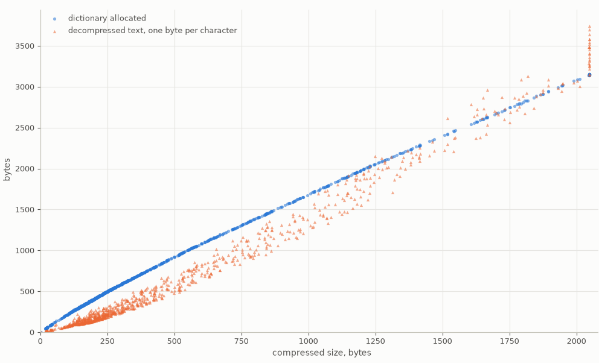

# decs: a small C11 decompressor for lz-string compressToUTF16 bytestreams, ASCII output

`decs` is a header-only C 2011 decompressor for lz-string. It is equivalent to conversion from bytes to UTF-16 per Little-Endian without Byte Order Mark convention, followed by decompression per LZString.decompressFromUTF16, then clamping every character to the range [32…127]. It is believed compatible with the output of all LZString.compressToUTF16 implementations followed by conversion from UTF-16 to bytes per said convention.

The code aims at correctness, interoperability, moderate RAM usage, speed and clarity.

#### Bytes allocated for the dictionary, and decompressed size, against the compressed size, over the 1000 known answer tests:



RAM usage can be reduced further, to a few hundred bytes; contact the author, François Grieu, Spirtech.

## License

Everything here, code, tests and documentation, is released under CC0 1.0 Universal; the full text is in `LICENSE`.

To the extent possible under law, the author has dedicated all copyright and related and neighboring rights to this work to the public domain worldwide.

You may copy, modify, distribute and perform the work, even for commercial purposes, all without asking permission.

## Acknowledgements

The algorithm is derived from Pieroxy's lz-string https://pieroxy.net/blog/pages/lz-string/index.html and checked against code at or linked at GitHub repository https://github.com/pieroxy/lz-string

It borrows from LZW of Welch, T. A. (1984). "A Technique for High-Performance Data Compression." Computer, 17(6): 8–19. https://doi.org/10.1109/MC.1984.1659158

## Build and test

`make` builds `decscli` with gcc, runs its built-in checks, then the known answer tests with `katcheck.py`; it needs gcc, make and Python 3. `make lint` compiles the header alone with strict warnings. `crosscheck.py` compares every file against the `lzstring` package of pip, `pip install lzstring`, and Python's JSON parser. Under MSYS2 use `make PY=py EXE=.exe`.

## Decompression algorithm

The compressed data is a string of *k* bytes. If *k* is odd or below 2, the data is invalid.

For *i* in the range [0…*k* − 1], a byte *u*<sub>*i*</sub> is treated as an integer in the range [0…255]. For *i* in the range [0…*k*/2 − 1], *v*<sub>*i*</sub> = 256*u*<sub>2*i*+1</sub> + *u*<sub>2*i*</sub>.

For *i* in the range [0…15*k*/2 − 1] we define the bit *w*<sub>*i*</sub> = ⌊(*v*<sub>⌊*i*/15⌋</sub> + 32736)/2<sup>14−(*i* mod 15)</sup>⌋ mod 2, that is bit 14 − (*i* mod 15) of *v*<sub>⌊*i*/15⌋</sub> + 32736; bit 15 of that sum is ignored.

The beginning of these 15*k*/2 bits *w*<sub>*i*</sub> is consumed by the decompression. It produces decompressed text, initially empty. The decompression maintains these variables:

- The current index *i* into the bits *w*<sub>*i*</sub>. Initially *i* = 0.
- The index *m* of the next dictionary string. Initially *m* = 3.
- A dictionary associating a non-empty string of character(s) with every index in the range [3…*m* − 1]. Initially the dictionary is empty.
- The dictionary index *p* of the previous string of character(s) appended to the decompressed text, if there has been one. Initially *p* = 0.

The decompression repeats this sequence:

- *x* ← 0
- For *j* from 0 to the largest integer *n* such that 2<sup>*n*</sup> ≤ *m*:
    - If *i* ≥ 15*k*/2 then the compressed data is invalid.
    - Otherwise *x* ← *x* + *w*<sub>*i*</sub> 2<sup>*j*</sup>
    - *i* ← *i* + 1
- If *x* > *m* then the compressed data is invalid.
- If *x* = 2 (end symbol):
    - Decompression is complete. The unprocessed bits *w*<sub>*i*</sub> are ignored.
- If *x* ≠ *m* then *q* ← *x*, else if *p* ≠ 0 then *q* ← *p*, else the compressed data is invalid.
- If *x* ≤ 1 (character definition) then:
    - *y* ← 0
    - For *j* from 0 to 8*x* + 7:
        - If *i* ≥ 15*k*/2 then the compressed data is invalid.
        - Otherwise *y* ← *y* + *w*<sub>*i*</sub> 2<sup>*j*</sup>
        - *i* ← *i* + 1
    - If *y* < 32 then *y* ← 32; if *y* > 127 then *y* ← 127.
    - *x* ← *m* and *q* ← *m*
    - The dictionary entry of index *m* becomes the 1-character string of value *y*
    - *m* ← *m* + 1
- If *p* ≠ 0 then
    - The dictionary entry of index *m* becomes the dictionary string of index *p*, followed by the first character of the dictionary string of index *q*
    - *m* ← *m* + 1
- *p* ← *x*
- Append the string of index *p* to the end of the decompressed text.

The decompressed text consists of characters in the range [32…127].

## Interface

Header `decs.h`, with include guard, one function, `static inline` so that a translation unit including without calling draws no warning:

```c
typedef int32_t (*tDecsConsumer)(void *inContext, uint16_t inChar);

static inline int32_t decs(const uint8_t *inCompressed,  // compressed data
                           int32_t        inSize,        // its size in bytes, k
                           tDecsConsumer  inConsumer,    // function that receives the decompressed text
                           void          *inContext);    // passed unchanged to inConsumer
```

The two pointers are not checked for NULL. `decs` outputs the decompressed text through `inConsumer`, one character per call, in order, as a `uint16_t` holding the character value *y*. When `inConsumer` returns a non-zero value, `decs` stops at once and returns that value; characters already delivered stay delivered.

`decs` returns 0 on success (end symbol reached), the consumer's non-zero value, or one of the diagnostics below.

## Diagnostics

Enumeration constants, values from 29300 up:

| symbol | value | condition |
|---|---|---|
| kDecsErrSize | 29300 | *k* odd or below 2 |
| kDecsErrBits | 29301 | *i* ≥ 15*k*/2 while reading a codeword or a character |
| kDecsErrIndex | 29302 | *x* > *m* |
| kDecsErrFirst | 29303 | *x* = *m* with *p* = 0, that is a first codeword of 3 |
| kDecsErrCapacity | 29304 | *m* > 65442, more entries than a 16-bit entry represents |
| kDecsErrMemory | 29305 | `realloc` failed, or the array would exceed 32760 bytes where `size_t` is 16-bit |

The size check is made before decompression starts, so kDecsErrSize is returned before any character is delivered.

## Dictionary

The dictionary is a trie: one `uint16_t` *g*<sub>*j*</sub> per entry *j* in [3…*m* − 1], at position *j* − 3 of an array. NC = 96 is the number of distinct characters.

- *g* in [0…NC − 1] represents the character 32 + *g*.
- *g* ≥ NC represents the dictionary entry at position *g* − NC, that is of index *g* − NC + 3.

The integer stored is dictated by the decompression:

- when entry *m* becomes the 1-character string of value *y*, *g*<sub>*m*</sub> = *y* − 32;
- when entry *m* becomes the string of *p* followed by the first character of the string of *q*, *g*<sub>*m*</sub> represents the index *x* as it stands then: *q*, except in the case *x* = *m* where it is *m* itself, a self-reference.

The string of entry *j* is recovered from the trie alone:

- if *g*<sub>*j*</sub> is a character, the 1-character string;
- otherwise the string of the prefix entry of *j*, followed by the first character of the string of the index *g*<sub>*j*</sub> represents. The first character of any entry is that of the root of its prefix chain, so a self-reference yields the first character of *j* itself. The prefix entry of *j* is the index the previous iteration appended, found from a neighbour, the *source* *s*(*j*): *s*(*j*) = *j* − 1 if *j* − 1 = 3 or *g*<sub>*j*−1</sub> represents an index, else *j* − 2 (entry *j* − 1 is then a character defined in the same iteration as *j*, and *j* − 2 is a concatenation or 3). The prefix is 3 if *s*(*j*) = 3, else the index *g*<sub>*s*(*j*)</sub> represents.

The prefix of *j* is below *j*, and the index *g*<sub>*j*</sub> represents is at most *j*. Every walk therefore terminates, malformed data included.

While the string of an entry is appended to the text, the trie serves as the stack of the walk: some entries are temporarily overwritten with links to their child, and restored before the append completes.

The array starts NULL with 0 entries and grows by `realloc` when an entry is to be stored beyond its size, by max(6, *r*) − 4 bytes, *r* being the number of compressed bytes not yet fetched, so at least 2 bytes. It is freed before `decs` returns. Entry *m* is refused with kDecsErrCapacity when *m* − 3 + NC exceeds 65535, so that every index representation fits a `uint16_t`. The plot at the top shows the bytes allocated against the compressed size over the known answer tests.

## Known answer tests

The directory `kat/` holds 1000 compressed files `<sha256>_<i>.bin`, generated from random JSON. Each decompresses to ASCII text, one byte per character, with the SHA-256 given in lowercase hexadecimal, and being strict RFC 8259 JSON with an object at top level, minimized, except `e3b0c44298fc1c149afbf4c8996fb92427ae41e4649b934ca495991b7852b855_2.bin`, which decompresses to the empty text. The number of distinct characters in a text is spread from about 32 to 96. About 5% of the files contain a test string designed to exercise the correctness of JSON parsers with respect to `\"` and `\\`, and the less-than-greediness of some compressors. 80% of the files are made by an optimizing compressor padding the stream at the lowest threshold that keeps compatibility with all known decompressors, the rest by a variety of greedy or near-greedy compressors. On those files that are over 200 bytes, the optimizing compressor saves in the order of 2% ± 1% over a pure-greedy one. The decimal *i* is the number of bits the decompression consumes, end symbol included, so the file truncated to its first 2⌊(*i* + 14)/15⌋ bytes must decompress identically, and one byte pair less must be refused with kDecsErrBits, or with kDecsErrSize when nothing is left.

`decscli.c`, a command line around the header writing the text one byte per character, and `katcheck.py`, which runs the files through it and checks all of the above, come with the files. `decscli -t` checks the diagnostics on streams made in memory: sizes 0 and 3; bits 11, a first codeword of 3; bits 00 01100110 101, the character `f` then a codeword of 5 with *m* = 4; a definition cut short; one character then references to entry 3 up to entry 65442, accepted, and 65443, refused. `crosscheck.py` compares every file against the `lzstring` package of pip and Python's JSON parser.
